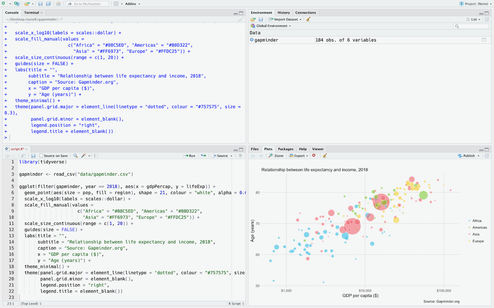
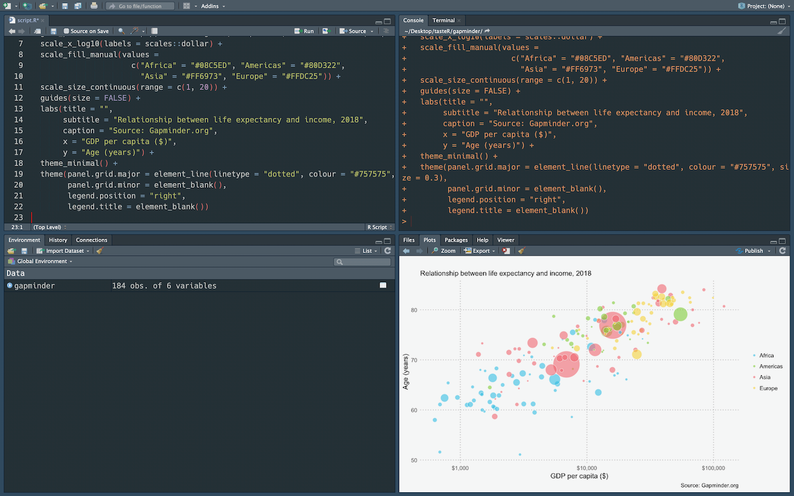
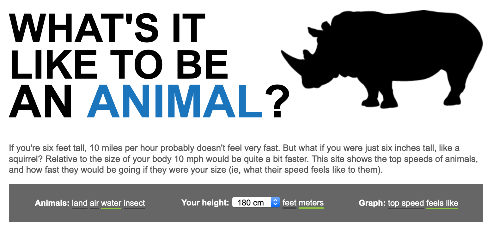

---
output:
  html_document:
    theme: cerulean
    toc: true
    toc_depth: 2
    toc_float:
      collapsed: false
      smooth_scroll: false
    df_print: paged
---

```{r setup, include=FALSE}
knitr::opts_chunk$set(echo = TRUE)

library(tidyverse)
```

tasteR
================

This workshop is designed to give you a taste of what [R](https://www.r-project.org/) can do. We'll run through the process of importing, tidying, transforming, visualising and reporting data using the suite of packages that make up the [tidyverse](https://www.tidyverse.org). These packages help lower the barrier to entry for new users and will hopefully inspire you to code regularly in R.

**Learning outcomes**

By the end of the workshop you'll:

- Be familiar with the [RStudio](https://www.rstudio.com/) interface
- Read data into R and inspect it
- Query and transform data
- Understand how to build graphics using ggplot2

## R

#### What is R?

R is an open source programming language for statistical analysis and data visualisation. It was developed by Ross Ihaka and Robert Gentleman of the University of Auckland and released in 1995. There are now over 14,000 [packages available for R](https://cran.r-project.org/web/packages/) which provide functions for machine learning, genomics, time series forecasting, and interactive graphics amongst many others. 

R is widely used in academia and rapidly [replacing SPSS](https://datahowler.wordpress.com/2016/09/10/no-more-excuses-r-is-better-than-spss-for-psychology-undergrads-and-students-agree/) and other proprietary statistical software in undergraduate programmes. It is also used by well known companies like [Google](https://ai.google/research/pubs/pub37483), [Netflix](https://www.youtube.com/watch?v=dLKky1xIxtc) and [Airbnb](https://peerj.com/preprints/3182.pdf) for data analytics. Many graphics published by news outlets like the [Financial Times](https://johnburnmurdoch.github.io/slides/r-ggplot/#/) and the [BBC](https://medium.com/bbc-visual-and-data-journalism/how-the-bbc-visual-and-data-journalism-team-works-with-graphics-in-r-ed0b35693535) are  generated in R. The UK Government is also embracing R to help make their [statistical reporting](https://dataingovernment.blog.gov.uk/2017/11/27/transforming-the-process-of-producing-official-statistics/) workflow more efficient and [reproducible](https://dataingovernment.blog.gov.uk/2017/03/27/reproducible-analytical-pipeline/).

#### Why use R?

- free
- open source
- advanced statistical analysis
- publication ready graphics
- increasingly used to support undergraduate teaching of statistics
- programming skills are attractive to employers

Since R is a language it is also:

- open
- shareable
- reproducibile
- human readable
- [diffable](https://en.wiktionary.org/wiki/diffable)

and therefore supports the principles of open science.
<br />

There are also several R packages useful for those working in local government. For example, the [fingertipsR](https://github.com/ropensci/fingertipsR) package enables you to download population and public health indicators.

## RStudio

[RStudio](https://www.rstudio.com/products/RStudio/) is an integrated development environment (IDE) for R. It's intuitive interface makes working with R much easier. It supports syntax highlighting, tab completion and is integrated with [R Markdown](https://rmarkdown.rstudio.com/). 

RStudio is freely available under the [GNU Affero General Public License v3](http://www.gnu.org/licenses/agpl-3.0-standalone.html). A commercial desktop license is also available.

#### The panes      
RStudio has four different panes:

<br />
<figure>
 
 <figcaption>
 RStudio's panes
 </figcaption>
</figure>
<br />

- The **Console** pane (top left) is used to execute R commands immediately.

- The **Environment** pane (top right) shows the datasets, models, and plots that are loaded in the current R session. This pane also contains tabs with a scrollable history of executed code, connections to databases and [Git](https://git-scm.com/) options.

- The **Files** pane (bottom right) shows plots and interactive web content, help documentation, previous commands, and R packages that you can install and load.

- The **Source** pane (bottom left) appears when you open a new file e.g. *File -> New File -> R Script*. Code can be saved in dedicated .R scripts and executed in the console with Ctl-Enter/Cmd-Enter. Syntax highlighting and tab completion are also available.

#### Customisation    
The appearance of RStudio can be changed to suit you:

- Increase the font size: *Tools > Global Options > Appearance > Editor Font size*
- Move the Console pane to the right: *View > Panes > Console on Right*
- Add a margin column line: *Tools > Global Options > Code > Display > Show margin*
- Automatic text wrapping: *Tools > Global Options > Code > Editing > Soft-wrap R source files*

You can also change RStudio's overall theme. Opting for a dark theme reduces the amount of glare that your eyes are subject to. Change the global theme to Dark by selecting 'Appearance' in the *Global Options* menu and opt for an Editor theme with a dark palette such as 'Material'.    

<br />
<figure>
 
 <figcaption>
 RStudio's dark mode
 </figcaption>
</figure>
<br />

#### Keyboard shortcuts    
RStudio has many useful shortcuts that enable you to keep your hands on the keyboard thereby boosting your coding productivity. For example,

- `Ctrl/Cmd + Enter`: Run your selected code in the Console
- `Ctrl/Cmd + Shift + M`: Add piping operator
- `Ctrl/Cmd + L`: Clear the console window
- `Ctrl/Cmd + Shift + R`: Add a section break
- `Shift + Ctrl/Cmd + 1`: Make the console full screen
- `Ctrl/Cmd + Shift + A`: Format your code

NB The use of Ctrl or Cmd depends on whether you are using a Windows or a Mac device.

For a complete list of all available shortcuts just type: `Alt + Shift + K`

## Setup

#### The data
The dataset that we will be exploring derives from [speedofanimals.com](http://www.speedofanimals.com/). These are measurements for speed, mass and length for a variety of animals living in the water, air and on land.    

<br />
<figure>
 <a href="http://www.speedofanimals.com/" target="_blank"></a> 
 <figcaption>
 Source: <a href="http://www.speedofanimals.com/">speedofanimals.com</a>
 </figcaption>
</figure>
<br />

The dataset contains 5 variables:   

- `name`: the common name of the animal
- `habitat`: whether the animal lives in water, air, or on land
- `length_cm`: the length of the animal in centimetres
- `mass_kg`: the mass of the animal in kilograms
- `speed_kph`: the top speed of the animal in kilometres per hour 

You can download the dataset from [here](https://www.trafforddatalab.io/workshops/data/speed_of_animals/speed_of_animals.csv).    

#### Organise your project       
Adopting a consistent folder structure for your data analyses will help to ensure that your projects are reproducible. A project can be organised using a simple file structure like this:

```
project/
|
├── data/          # store your datasets
|
├── script.R       # your R script
|
└── output/        # all your plots, models etc
```

Ideally, raw and intermediate datasets would be separated to ensure that you don't accidentally overwrite your data.

```
project/
|
├── data/
│   ├── raw/       # read-only pre-processed datasets
│   └── processed/ # intermediate datasets
|
├── script.R       # your R script
|
└── output/        # all your plots, models etc
```

#### Set your working directory   
Point your R session to your project folder using: *Session > Set Working Directory > Choose Directory*

NB It's not good practice to set your working directory at the top of your R script because absolute paths don't promote reproducibility.

*Optional*: Set up a [project in RStudio](https://support.rstudio.com/hc/en-us/articles/200526207-Using-Projects)

#### Open a new R script       
*File > New File > R Script*

#### Install R packages    
You only need to install an R package once. Subsequent package updates can be handled by selecting *Packages > Update* in the **Files** pane of RStudio.
```{r, eval=FALSE}
install.packages("tidyverse")
```

#### Load R packages 
Packages need to be loaded at the start of every R session to give you access to the functions you need.
```{r}
library(tidyverse)
```
 
## Import
R can handle a range of data formats: .csv, .xlsx, .sav, .dta, .sas, .xml, .json, .geojson etc. Some data formats require specific packages.

#### Read a CSV     
We can load a CSV file using the `read_csv` function with an argument which provides the file path to the dataset. A new object called `speedofanimals` is created which stores the data that we have loaded in the R session.

```{r message=FALSE}
speedofanimals <- read_csv("data/speed_of_animals.csv")
```

#### Inspect the data
The `glimpse()` function prints all the variables, their data types and the first few values.
```{r}
glimpse(speedofanimals)
```

#### Coerce data types

- **character** variables can store strings of characters
- **factor** variables can store a fixed and known set of possible values
- **integer** variables can only store whole numbers
- **double** variables can store decimal numbers
- **logical** variables can store TRUE or FALSE
- **date** variables can store a date - time

```{r}
speedofanimals <- read_csv("data/speed_of_animals.csv", 
               col_types = cols(
                 name = col_factor(NULL),
                 habitat = col_factor(NULL),
                 length_cm = col_integer(),
                 mass_kg = col_double(),
                 speed_kph = col_double()
                 ))
speedofanimals
```

## Tidy
Tidy data are structured for use in R and satisfy three rules:

1. Each variable must have its own column
2. Each observation must have its own row
3. Each value must have its own cell

<figure>

 <figcaption>
 Source: <a href="https://r4ds.had.co.nz/tidy-data.html"> R for Data Science</a>
 </figcaption>
</figure>
<br />
 
### `gather()`
Convert variable names into values and structure the dataframe into a more machine readable format (wide to long)
```{r}
speedofanimals_long <- gather(speedofanimals, measure, value, -name, -habitat)
speedofanimals_long
```

### `spread()`
Convert dataframe into a more tabular, human readable format (long to wide)
```{r}
spread(speedofanimals_long, measure, value)
```
Note that `pivot_long()` and `pivot_wide()` will shortly be available as [more intutively named functions](https://tidyr.tidyverse.org/dev/articles/pivot.html).

### `separate()`
Split out values stored in one variable into multiple variables
```{r}
split <- separate(speedofanimals_long, measure, c("measure", "unit"), sep = "_")
split
```

### `unite()`
Join values stored in multiple variables into one
```{r}
unite(split, measure, c(measure, unit), sep = "_")
```

## Transform

### `select()` {.tabset}
Pick and rename columns in a dataframe.

#### by name
```{r}
select(speedofanimals, name, speed_kph)
```

#### by exclusion
```{r}
select(speedofanimals, -speed_kph)
```

#### with a range
```{r}
select(speedofanimals, 1:3)
```

#### begins with
```{r}
select(speedofanimals, starts_with("hab"))
```

#### rename
```{r}
select(speedofanimals, animal = name)
```

***

### `filter()` {.tabset}
Subset rows in a dataframe by an expression.

#### less than
```{r}
filter(speedofanimals, length_cm < 100)
```

#### equal to
```{r}
filter(speedofanimals, name == "Roadrunner")
```

#### not equal to
```{r}
filter(speedofanimals, habitat != "Air")
```

#### with regex
```{r}
filter(speedofanimals, grepl("African", name))
```

#### by multiple conditions
```{r}
filter(speedofanimals, mass_kg > 1000 & habitat == "Land")
```

#### by a vector
```{r}
filter(speedofanimals, name %in% c("Coyote", "Roadrunner"))
```

***

### `arrange()` {.tabset}
Change the order of rows in a dataframe.

#### ascending order
```{r}
arrange(speedofanimals, speed_kph)
```

#### descending order
```{r}
arrange(speedofanimals, desc(speed_kph))
```

***

### `mutate()` {.tabset}
Create new variables with functions of existing columns in a dataframe.

#### calculation
```{r}
mutate(speedofanimals, speed_mph = speed_kph * 0.62137)
```

#### new data type
```{r}
mutate(speedofanimals, name = factor(name))
```

#### by multiple conditions
```{r}
mutate(speedofanimals, speed_mph = speed_kph * 0.62137,
       name = factor(name))
```

## `%>%` 
The piping operator allows you to combine multiple operations together in a chain. For example, 
```{r}
speedofanimals %>% 
  filter(habitat == "Air") %>% 
  mutate(speed_mph = speed_kph * 0.62137) %>%
  select(name, speed_mph) %>% 
  arrange(desc(speed_mph))
```

The pipe obviates the need to create objects for each intermediate transformation of your dataframe and makes your code more human readable. For example, the code above can be translated as:

*Filter rows in the speedofanimals dataframe whose values in the `habitat` column are equal to "air", **then** create a new column which calculates the speed in miles per hour of each animal, **then** select the `name` and `speed_mph` columns, and **then** sort the resulting rows by the values of `speed_mph` in descending order.*

The piping operator makes it easy to apply functions to dataframes grouped by specific variables. For example, the code below use the `group_by()` and `summarise()` functions to calculate the mean speed of animals by habitat

```{r}
speedofanimals %>% 
  mutate(speed_mph = speed_kph * 0.62137) %>% 
  group_by(habitat) %>% 
  summarise(mean_speed_mph = round(mean(speed_mph), 1)) %>% 
  arrange(desc(mean_speed_mph))
```

## Visualise

> "A statistical graphic is a mapping from data to aesthethic attributes (colour, shape, size) of geometric objects (points, lines, bars)."    
> Hadley Wickham (2016)

```{r, echo=FALSE, message=FALSE, warning=FALSE}
library(ggiraph) ; library(scales)
temp  <- speedofanimals %>% 
  mutate(name = str_replace_all(name, "'", ""),
         tooltip = paste0("Name: ", name, "<br/>",
                          "Habitat: ", habitat, "<br/>",
                          "Mass: ", mass_kg, " kg", "<br/>",
                          "Speed: ", speed_kph, " kph", "<br/>",
                          "Length: ", length_cm, " cm"))
tooltip_css <- "background-color:transparent;font-style:italic;"
p <- ggplot(temp, aes(x = mass_kg, y = speed_kph)) +
  geom_point_interactive(aes(size = length_cm, fill = habitat,
                             tooltip = tooltip), shape = 21, colour = "black", alpha = 0.6) +
  scale_fill_brewer(palette = "Set2") +
  scale_size_continuous(range = c(1, 10)) +
  scale_x_continuous(trans = log_trans(), breaks=c(1,10,100,10000)) +
  scale_y_continuous(trans = log_trans(), breaks=c(1,10,100)) +
  labs(title = "Relationship between body mass and speed namongst selected animals",
       subtitle = "Size is proportional to length (cm)",
       caption = "Source: speedofanimals.com",
       x = "Body mass (kg, log)",
       y = "Top speed (kph, log)") +
  guides(fill = FALSE, size = FALSE) +
  theme_minimal() +
  theme(
    plot.margin = unit(rep(30, 4), "pt"),
    panel.grid.minor = element_blank(),
    plot.title = element_text(size = 10),
    plot.subtitle = element_text(size = 8),
    axis.title = element_text(size = 8, face = "plain", hjust = 1),
    plot.caption = element_text(size = 8, hjust = 1, margin = margin(t = 15)),
    legend.position = "top",
    legend.title = element_blank()
  ) 
p <- girafe(code = print(p))
girafe_options(p, opts_tooltip(use_fill = TRUE))
```

|Variable |Geometry |Aesthetic  | 
|:--- |:---- |:----:|
|mass_kg |point |x-position |
|speed_kph |point |y-position |
|length_cm |point |size |
|habitat |point |fill |

### Building a plot

#### Initialise a `ggplot()` object
```{r, fig.width=8}
ggplot()
```

#### Load the data and map variables to the x and y axes
```{r, fig.width=8}
ggplot(data = speedofanimals,
       aes(x = mass_kg, y = speed_kph))
```

#### Add points
```{r, fig.width=8}
ggplot(data = speedofanimals,
       aes(x = mass_kg, y = speed_kph)) +
  geom_point()
```

#### Optional: change the colour of the points
```{r, fig.width=8}
ggplot(data = speedofanimals,
       aes(x = mass_kg, y = speed_kph)) +
  geom_point(colour = "tomato")
```

#### Map the `habitat` variable to fill and add a border to the points
```{r, fig.width=8}
ggplot(data = speedofanimals,
       aes(x = mass_kg, y = speed_kph, fill = habitat)) +
  geom_point(shape = 21, colour = "black", alpha = 0.6)
```

#### Log transform the scale
```{r, fig.width=8}
library(scales)
ggplot(data = speedofanimals,
       aes(x = mass_kg, y = speed_kph, fill = habitat)) +
  geom_point(shape = 21, colour = "black", alpha = 0.6) +
  scale_x_continuous(trans = log_trans(), breaks=c(1,10,100,10000)) +
  scale_y_continuous(trans = log_trans(), breaks=c(1,10,100))
```

#### Add a title, label the axes, include a caption, and change the legend title
```{r, fig.width=8}
ggplot(data = speedofanimals,
       aes(x = mass_kg, y = speed_kph, fill = habitat)) +
  geom_point(shape = 21, colour = "black", alpha = 0.6) +
  scale_x_continuous(trans = log_trans(), breaks=c(1,10,100,10000)) +
  scale_y_continuous(trans = log_trans(), breaks=c(1,10,100)) +
  labs(title = "Relationship between body mass and speed \namongst selected animals",
       caption = "Source: speedofanimals.com",
       x = "Body mass (kg, log)",
       y = "Top speed (kph, log)",
       fill = "Habitat")
```

#### Change the overall theme
```{r, fig.width=8}
ggplot(data = speedofanimals,
       aes(x = mass_kg, y = speed_kph, fill = habitat)) +
  geom_point(shape = 21, colour = "black", alpha = 0.6) +
  scale_x_continuous(trans = log_trans(), breaks=c(1,10,100,10000)) +
  scale_y_continuous(trans = log_trans(), breaks=c(1,10,100)) +
  labs(title = "Relationship between body mass and speed \namongst selected animals",
       caption = "Source: speedofanimals.com",
       x = "Body mass (kg, log)",
       y = "Top speed (kph, log)",
       fill = "Habitat") +
  theme_minimal() 
```

#### Map `length_cm` to size and add some further tweaks
```{r, fig.width=8}
ggplot(data = speedofanimals,
       aes(x = mass_kg, y = speed_kph, fill = habitat, size = length_cm)) +
  geom_point(shape = 21, colour = "black", alpha = 0.6) +
  scale_fill_brewer(palette = "Set2") +
  scale_size_continuous(range = c(1, 10)) +
  scale_x_continuous(trans = log_trans(), breaks=c(1,10,100,10000)) +
  scale_y_continuous(trans = log_trans(), breaks=c(1,10,100)) +
  labs(title = "Relationship between body mass and speed \namongst selected animals",
       caption = "Source: speedofanimals.com",
       x = "Body mass (kg, log)",
       y = "Top speed (kph, log)",
       fill = "Habitat",
       size = "Length (cm)") +
  theme_minimal() +
  theme(
    plot.margin = unit(rep(30, 4), "pt"),
    panel.grid.minor = element_blank(),
    axis.title = element_text(size = 8, face = "plain", hjust = 1),
    plot.caption = element_text(size = 8, hjust = 1, margin = margin(t = 15)))
```

#### Save the plot as a png at a high resolution
```{r, eval=FALSE}
ggsave("scatterplot.png", scale=1, dpi=300)
```

#### Add interactivity
```{r, fig.width=8, message=FALSE}
library(ggiraph)
speedofanimals$name <- str_replace_all(speedofanimals$name, "'", "")
p <- ggplot(data = speedofanimals,
       aes(x = mass_kg, y = speed_kph, fill = habitat, size = length_cm)) +
  geom_point_interactive(aes(tooltip = name), shape = 21, colour = "black", alpha = 0.6) +
  scale_fill_brewer(palette = "Set2") +
  scale_size_continuous(range = c(1, 10)) +
  scale_x_continuous(trans = log_trans(), breaks=c(1,10,100,10000)) +
  scale_y_continuous(trans = log_trans(), breaks=c(1,10,100)) +
  labs(title = "Relationship between body mass and speed \namongst selected animals",
       caption = "Source: speedofanimals.com",
       x = "Body mass (kg, log)",
       y = "Top speed (kph, log)",
       fill = "Habitat",
       size = "Length (cm)") +
  theme_minimal() +
  theme(
    plot.margin = unit(rep(30, 4), "pt"),
    panel.grid.minor = element_blank(),
    axis.title = element_text(size = 8, face = "plain", hjust = 1),
    plot.caption = element_text(size = 8, hjust = 1, margin = margin(t = 15)))
girafe(code = print(p))
```

## Model 

#### Calculate body lengths per second: (metres per second / length)
```{r}
speedofanimals <- speedofanimals %>% 
  mutate(body_lengths_s_km = ((speed_kph*1000) / 3600) / (length_cm / 100))
select(speedofanimals, name, body_lengths_s_km) %>% 
  arrange(desc(body_lengths_s_km))
```

#### Calculate what speed 'feels like' when 6ft (1.83m) tall
```{r}
speedofanimals <- speedofanimals %>% 
  mutate(rel_speed_kph = ((body_lengths_s_km * 1.83) * 3600) / 1000)
select(speedofanimals, name, body_lengths_s_km, rel_speed_kph) %>% 
   arrange(desc(rel_speed_kph))
```

## Communicate

The [rmarkdown](https://rmarkdown.rstudio.com/index.html) package allows you to write dynamic reports in R. These are plain text files (.Rmd) written in [markdown](https://daringfireball.net/projects/markdown/) containing chunks of embedded R code.

#### Why use it?
- Documents with embedded code are reproducible
- Integrates the entire data analysis workflow from importing to reporting.
- Documents can be outputted to a variety of formats: HTML, PDF, Microsoft Word, slideshows, dashboards, websites, and books.

### Markdown

Markdown is a simple syntax that allows you to add formatting to plain text. By enclosing text with asterisks you can add `*emphasis*` or write inline ``` `code` ``` with backticks.

#### Emphasis   
Use asterisks and tilde to add emphasis to your text.

`**bold**` → **bold**

`*italics*` → *italics*

`***bold italics***` → ***bold italics***

`~~strikethrough~~` → ~~strikethrough~~

#### Paragraphs   
End a line with two or more spaces to create a line break. You can also use HTML break `<br />` tags.

#### Headings   
To create a header begin a line with a hashtag. Each additional hashtag makes the header smaller.

```no-highlight
# 1st level heading   
## 2nd level heading   
### 3rd level heading   
#### 4th level heading   
##### 5th level heading
```

#### Links   
Place the link text in square brackets and the URL path in parentheses.

```no-highlight
Download and install the latest version of R [here](https://www.r-project.org).
```

Download and install the latest version of R [here](https://www.r-project.org).

#### Images   
Place (optional) explanatory text in brackets and the image URL or path in parentheses, preceded by an exclamation mark.   

```no-highlight
  
```

 

To resize your image just use HTML:

```no-highlight
<figure>

<figcaption>Image: wikipedia.org</figcaption>
</figure>
```

<figure>

<figcaption>Image: wikipedia.org</figcaption>
</figure>

#### Code
**Inline code**   
Wrap code in single backticks.

```no-highlight
Today’s date is `format(Sys.time(), '%d %B, %Y')`
```

Today’s date is `r format(Sys.time(), '%d %B, %Y')`

**Code blocks**    
Place 3 backticks on a line above and below the code block.   

<pre lang="no-highlight"><code>```r
ggplot(data = speedofanimals, aes(x = mass_kg, y = speed_kph)) +
  geom_point()
```
</code></pre>

```r
ggplot(data = speedofanimals, aes(x = mass_kg, y = speed_kph)) +
  geom_point()
```

#### Blockquotes   
Blockquotes start the first line with a greater than symbol.

```no-highlight
> There are no emergency meetings, no headlines, no breaking news. No one is acting as if we were in a crisis. Even most climate scientists or green politicians keep on flying around the world, eating meat and dairy. […] Today we use 100 million barrels of oil every single day. There are no politics to change that. There are no rules to keep that oil in the ground. So we can't save the world by playing by the rules. Because the rules have to be changed. Everything needs to change. And it has to start today. 
> (Greta Thunberg) 
```

> There are no emergency meetings, no headlines, no breaking news. No one is acting as if we were in a crisis. Even most climate scientists or green politicians keep on flying around the world, eating meat and dairy. […] Today we use 100 million barrels of oil every single day. There are no politics to change that. There are no rules to keep that oil in the ground. So we can't save the world by playing by the rules. Because the rules have to be changed. Everything needs to change. And it has to start today. 
> (Greta Thunberg)

#### Lists

**Bullet points**    
Precede each line in a list with a single asterisk, hyphen or plus sign.

```no-highlight
- Land
- Air
- Water
```

- Land
- Air
- Water

**Numbered lists**    
Precede each line in a list with a number and full stop.

```no-highlight
1. Land
2. Air
3. Water
```

1. Land
2. Air
3. Water

To prevent text starting with a number being formatted as a numbered list just add a backslash.

```no-highlight
1\. Land
```

1\. Land

**Nested lists**    
Indent each item in the sublist by four spaces.

```no-highlight
1. Land:
    - African Bush Elephant
    - African Wild Dog
    - Black Mamba
    - Brown Bear
    - Cheetah
    - Coyote
    - Domestic Cat
    - Eastern Gray Squirrel
```

1. Land:
    - African Bush Elephant
    - African Wild Dog
    - Black Mamba
    - Brown Bear
    - Cheetah
    - Coyote
    - Domestic Cat
    - Eastern Gray Squirrel

#### Tables

Divide words with hyphens to create the column names and then separate each row with a pipe. Colons are used to align the values in the cells.

```no-highlight
|      |Column 1 |Column 2 |Column 3  | 
|:---- |:------- |:-------:| --------:|
|Row 1 |is |is |is |
|Row 2 |left |centre |right |
|Row 3 |aligned |aligned |aligned | 
```

|      |Column 1 |Column 2 |Column 3  | 
|:---- |:------- |:-------:| --------:|
|Row 1 |is |is |is |
|Row 2 |left |centre |right |
|Row 3 |aligned |aligned |aligned | 

### R Markdown

The workflow for creating a dynamic document in R is:

1. Create a new R Markdown document from the menu: *File -> New File -> R Markdown*
2. Create a YAML header
3. Write the content with markdown
4. Embed the R code in code chunks or inline code
5. Click the Knit button to compile it

*** 

<br /><br />

## Further resources

The following list of online books, MOOCs and blog post should help you to explore R in more depth:

**Beginner**     
- [RStudio primers](https://rstudio.cloud/learn/primers)   
- [R for Data Science](https://r4ds.had.co.nz/)   
- [Stat545](https://stat545.com/)   
- [Hands-On Programming with R](https://rstudio-education.github.io/hopr/)
- [swirl](https://swirlstats.com/)   
- [Johns Hopkins Data Science Specialization](https://www.coursera.org/specializations/jhu-data-science) on Coursera   
- [Data Carpentry lessons](https://datacarpentry.org/lessons/)   
- [R Studio Webinars](https://resources.rstudio.com/)

**Intermediate and advanced**   
- [What They Forgot to Teach You About R](https://whattheyforgot.org/)   
- [Advanced R](https://rstudio-education.github.io/hopr/)   

**Statistics**   
- [Discovering Statistics Using R](https://uk.sagepub.com/en-gb/eur/discovering-statistics-using-r/book236067)   
- [Statistics: An Introduction Using R](https://www.wiley.com/en-gb/Statistics%3A+An+Introduction+Using+R%2C+2nd+Edition-p-9781118941096)   

**Data visualisation**    
- [Fundamentals of Data Visualization](https://serialmentor.com/dataviz/) 
- [Data Visualization: A practical introduction](http://socviz.co/)   
- [R Graphics Cookbook](http://www.cookbook-r.com/)    
- [BBC Visual and Data Journalism cookbook for R graphics](https://bbc.github.io/rcookbook)   
- [ggplot2 graphics companion](https://www.trafforddatalab.io/graphics_companion/)

**Style guides**      
- [The tidyverse style guide](http://style.tidyverse.org/)   
- [Google's R Style Guide](https://google.github.io/styleguide/Rguide.xml)

**R user groups**    
- [Manchester R](http://www.rmanchester.org/)   
- [London R](http://www.londonr.org/)   
- [R-Ladies](https://rladies.org)   

**Help**   
- [StackOverflow](https://stackoverflow.com/questions/tagged/r)   
- [RStudio Community](https://community.rstudio.com)   
- [Twitter #rstats hashtag](https://twitter.com/search?q=%23rstats&src=tyah)
